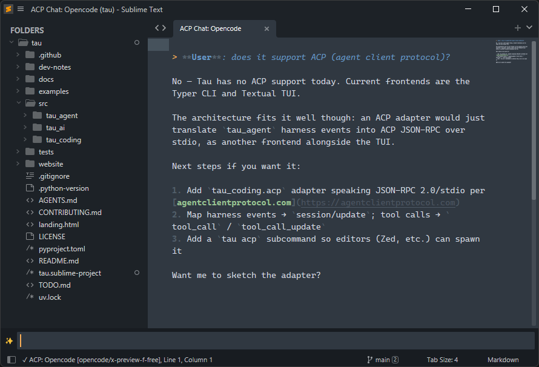

# ACP - Agent Client Protocol for Sublime Text

Use AI coding agents (Kiro, Opencode, Pi, Droid, Claude Code, Copilot, …) directly from Sublime Text via the [Agent Client Protocol](https://agentclientprotocol.com/).



## Installation

1. Clone or copy this package into your Sublime Text `Packages/` directory:

```shell
git clone https://github.com/debjan/sublime-acp ACP
```

2. Restart Sublime Text.

## Quick Start

### One-shot prompt

1. `Ctrl+Shift+P` -> **"ACP: Prompt"**
2. Pick an agent from the quick panel (skipped if only one is configured)
3. Type your prompt in the input panel - use `@` for file autocompletion, `/` for agent slash commands
4. Press Enter - the response streams into a new tab

### Persistent chat session (daemon)

1. `Ctrl+Shift+P` -> **"ACP: Start Agent Session"**
2. Pick an agent - a spinner shows while the agent initializes
3. Once ready, a dedicated **"ACP Chat: Agent Name"** tab opens
4. Send prompts via **"ACP: Prompt"** - responses accumulate in the chat tab
5. Stop the session with **"ACP: Stop Agent Session"**

The daemon auto-terminates after 15 minutes of inactivity (configurable).

### Continue a previous session

- `Ctrl+Shift+P` -> **"ACP: Continue Last Session"** - reconnects to your last session

### Walkthrough

For quick walkthrough visit [walkthrough.md](docs/walkthrough.md)

## Configuration

Edit `ACP.sublime-settings` (Preferences -> Package Settings -> ACP):

```jsonc
{
  // Agents you want to use
  "commands": [
    { "title": "Claude Code", "cmd": "claude-agent-acp" },
    { "title": "Opencode", "cmd": "opencode", "args": ["acp"] },
  ],

  // Quick actions (palette: ACP: Actions, sent with selected text)
  "actions": [
    { "title": "Explain", "prompt": "Explain in simple terms" },
    { "title": "Summarize", "prompt": "Summarize with key points" },
  ],

  // Custom system prompt (null = use built-in defaults)
  "system_prompt": null,
}
```

**Note:** To enable keyboard shortcut open "Preferences: ACP Key Bindings" from Command Palette.

## Commands

| Palette Command               | Keybinding         | Description                                    |
| ----------------------------- | ------------------ | ---------------------------------------------- |
| ACP: Start Agent Session      | `Ctrl+Alt+A`       | Start a persistent agent daemon                |
| ACP: Stop Agent Session       | `Ctrl+Alt+Shift+A` | Terminate the running daemon                   |
| ACP: Send Prompt              | `Alt+Shift+A`      | One-shot prompt (or send to daemon)            |
| ACP: Interrupt Current Prompt | `Ctrl+Break`       | Cancel the in-flight prompt (daemon only)      |
| ACP: Continue Agent Session   | -                  | Reconnect to your last session                 |
| ACP: Switch Model             | -                  | Change model mid-session (daemon only)         |
| ACP: Switch Mode              | -                  | Change session mode mid-session (daemon only)  |

### Switching model or mode

While a daemon session is active, **ACP: Switch Model** and **ACP: Switch Mode** show a quick panel populated from the agent's advertised `config_options`. The current selection is marked with `✓`. These commands are only enabled when the active agent supports the corresponding option - agents like Opencode, Pi, Claude Code, and Droid expose model switching; Opencode and Claude Code also expose mode switching (e.g. `build` / `plan`).

## Requirements

- Sublime Text 4+
- One or more ACP-compatible agents installed on your PATH

## Documentation

Deeper dives live in [docs/index.md](docs/index.md): daemon architecture, permissions and the file walker, completions, and full settings reference.

## License

MIT
