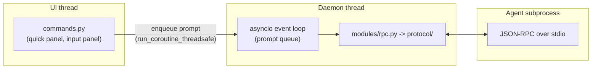
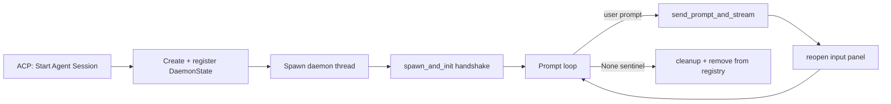

# Daemon Architecture

Each Sublime Text window can host one **persistent agent session** - the *daemon*.

Instead of spawning a fresh agent process for every prompt, the daemon keeps an agent subprocess alive in the background so session context (files read, edits made, conversation history) survives across many prompts.

## Where the code lives

| File                     | Responsibility                                                        |
| ------------------------ | --------------------------------------------------------------------- |
| `modules/daemon.py`      | Consolidated daemon: state, lifecycle, prompt loop, idle timer        |
| `modules/permissions.py` | Permission resolution pipeline (see [permissions.md](permissions.md)) |

## The three-thread design



1. **UI thread** - user actions (`acp_start`, `acp`, `acp_interrupt`, ...) run here. All Sublime API calls from background threads must be dispatched back through `sublime.set_timeout()` (the code uses the `ui.on_main()` helper).
2. **Daemon thread** - owns an `asyncio` event loop. Prompts are enqueued with `run_coroutine_threadsafe` onto an `asyncio.Queue`; a prompt loop pops items, sends them via `send_prompt_and_stream`, and streams responses into the output view.
3. **Agent subprocess** - spawned by `spawn_and_init` (handshake: initialize -> authenticate -> new/resume session), then stays connected.

## State management

`DaemonState` holds all per-window state behind a `threading.Lock`. Never touch fields directly:

```python
s = state.get("is_busy", "conn", "loop")   # atomic multi-field read
state.set(is_busy=True, last_activity=time.monotonic())  # atomic write
```

Daemons are registered per window id in `_daemon_registry` guarded by its own lock (`get_state` / `set_state` / `remove_state` / `stop_all_daemons`).

## Lifecycle at a glance



- **Interrupt** (`Ctrl+Break`) sends `$/cancelRequest` via `conn.cancel_pending_request(msg_id)` - the connection and session stay alive; no respawn needed.
- **Idle timeout** - a timer checks every 30 s; after `daemon_idle_timeout` seconds of inactivity the daemon shuts itself down. A pending permission prompt counts as activity, so the idle timer never kills a daemon while a prompt is open (`permission_pending` flag).
- **Manual stop / window close** - posts a `None` sentinel to the queue, joins the thread (5 s timeout; on timeout the process group is force-killed), resets state, and removes the registry entry.

## Error handling

| Failure                        | Behavior                                        |
| ------------------------------ | ----------------------------------------------- |
| `spawn_and_init` fails         | Cleanup, show error, mark not running           |
| Prompt stream times out        | Timeout message appended, return to idle        |
| Agent closes connection        | `ConnectionError` caught, error shown           |
| Thread join timeout (5 s)      | Force reset; process-group kill                 |
| Enqueue on closed loop         | State reset, removed from registry, error shown |

## Related docs

- [permissions.md](permissions.md) - how tool-call approvals work
- [configuration.md](configuration.md) - `daemon_idle_timeout`, `timeout`, `thoughts`
