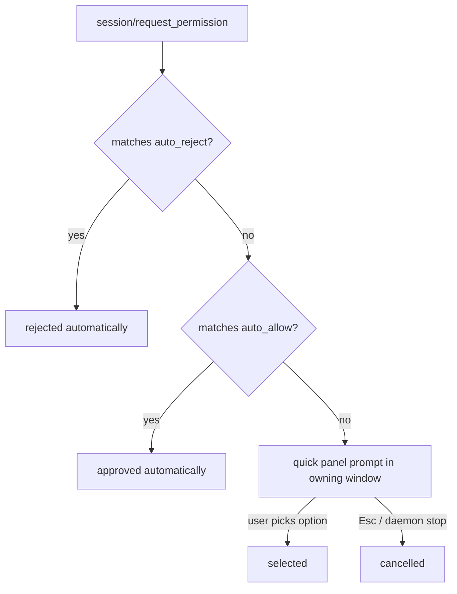

# Permissions

When an agent wants to use a tool (read a file, write a file, run a command), it sends a `session/request_permission` call. ACP resolves these requests automatically when possible and only bothers you when it must.

## Where the code lives

| File                     | Responsibility                                                       |
| ------------------------ | -------------------------------------------------------------------- |
| `modules/permissions.py` | Full permission resolution pipeline                                  |
| `ACP.sublime-settings`   | The `permissions` setting (`auto_allow`/`auto_reject`)               |
| `modules/config.py`      | `DEFAULT_PERMISSIONS = {"auto_allow": ["read*"], "auto_reject": []}` |

## Resolution pipeline

1. **Auto-reject** - fnmatch-style glob patterns are checked first; a match rejects the request immediately.
2. **Auto-allow** - same pattern matching; a match approves the request without any UI.
3. **Interactive prompt** - otherwise a quick panel opens *in the window that owns the daemon* (the code uses the explicit `window_id`, not `sublime.active_window()`), listing the options the agent offered.

## Key behaviors

- **Queued per window** - prompts are serialized behind a per-window `asyncio.Lock`; back-to-back requests each get their own panel instead of colliding (Sublime allows only one quick panel per window).
- **Hard timeout** - an open prompt is denied after `permission_prompt_timeout` seconds (default 300; `0` = wait forever). It is also cancelled by `dismiss_permission_prompt()` on daemon stop/reset.
- **Supersede fail-safe** - if a stale waiter is ever displaced, it is resolved with a deny so the agent can never hang on an unanswered request.
- **Async bridge** - the quick panel runs on Sublime's UI thread while the daemon's asyncio loop awaits an `asyncio.Event`; the user's choice is bridged back across threads.
- **Idle-safe** - while a permission prompt is pending, the daemon's idle timer will not shut the session down.
- **Host filesystem calls too** - ACP's own fs endpoints map onto kinds:
  - `fs/read_text_file` -> kind `read_file`,
  - `fs/write_text_file` -> kind `write_file`,
so the same patterns cover both agent tools and direct host-fs access.
- **One-shot mode** - unmatched writes are denied (no UI available); in daemon mode they prompt instead.

## File walker (project files for `@` completions)

Permissions also shape which files ACP itself enumerates for autocomplete:

| File                     | Responsibility                                                        |
| ------------------------ | --------------------------------------------------------------------- |
| `modules/file_walker.py` | `walk_project_files()` + `ProjectFileCache` (TTL, background refresh) |
| `modules/gitignore.py`   | `.gitignore` parsing -> `GitignoreRules`                              |

The walker runs `os.walk` on a background thread, skipping:

- anything matched by your project's `.gitignore` files (including `!` negation, `**` globs, per-segment directory matching), and
- folders/extensions from the `ignore` setting (e.g. `node_modules`, `.pyc`).

Results are cached per window with a TTL (`cache_ttl`, default 300 s); saving a file expires the cache so newly created files show up in `@` completions.

## Related docs

- [daemon.md](daemon.md) - how permission prompts interact with the idle timer
- [configuration.md](configuration.md) - the `permissions` and `ignore` settings
- [completions.md](completions.md) - how walked files feed `@` completions
