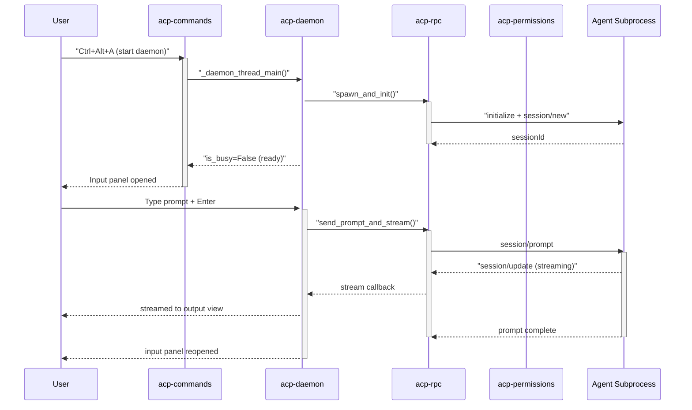

# Walkthrough - A Typical User Session

This page walks through a ACP session from the user's point of view: what happens on screen at each step, what you can do, and where the limits are. It assumes ACP is installed and at least one agent is configured (see the [README](../README.md#quick-start) and configuration.md).

## At a glance

There are two ways to talk to an agent, and they coexist:

| Mode              | Process lifetime                          | Context                 | Typical use                                  |
| ----------------- | ----------------------------------------- | ----------------------- | -------------------------------------------- |
| **One-shot**      | spawned per prompt, exits after the reply | none across prompts     | quick questions, code review, "explain this" |
| **Daemon (chat)** | persistent per window                     | survives across prompts | multi-step tasks, iterating on a change      |

## Session 1 - a quick one-shot prompt

1. **Open the prompt.** Select Command Palette -> *ACP: Prompt*. With several agents configured, a quick panel asks which one; with a single agent it is picked automatically.
2. **Type your prompt.** The input panel gives you two autocompletes (see completions.md):

   - `@` - file and folder paths in your project, filtered by your `.gitignore` and the `ignore` setting;
   - `/` - the agent's own slash commands, read from the agent during initialization.

3. **Press Enter.** A new scratch tab named *ACP Prompt:* opens and the response streams in as it is produced. Agent thinking chunks appear according to the `thoughts` setting (blockquotes in the tab, console-only, or dropped).
4. **The session ends.** When the reply finishes the agent subprocess is torn down. Nothing is remembered for the next prompt.

One-shot mode is deliberately read-only: agents are told to **never edit files** and to return diffs with `file:line` annotations instead. If the agent tries a filesystem write through ACP's `fs/writeTextFile` endpoint anyway, it is **denied** (no UI exists to approve it) unless you have an `auto_allow` rule for it.

## Session 2 - a persistent chat (daemon)

When you are going to iterate - "make this change, then fix the tests, then show me the diff" - a one-shot process can't keep up. Start a daemon instead.

1. **Start the session.** *ACP: Start Agent Session*, pick the agent. A spinner shows while the agent initializes: handshake -> authentication -> session creation (or resume).
2. **Chat tab appears.** A dedicated *ACP Chat:* tab opens in a split, and the input panel returns so you can keep typing.
3. **Chat as long as you like.** Each prompt is appended to the same tab; the agent keeps full context - files it read, edits it made, everything you discussed. `@` and `/` completions still work in the input panel.
4. **Approve tool use when asked.** If the agent requests a permission (e.g. a file write) that matches neither `auto_allow` nor `auto_reject`, a quick panel opens **in the window that owns the daemon** with the options the agent offered. Pick one and the turn continues; press Esc to cancel. The idle timer never shuts the daemon down while such a prompt is open (see permissions.md).
5. **Switch model or mode mid-session.** With *ACP: Switch Model* / *ACP: Switch Mode* a quick panel lists the options the agent advertises (Opencode, Pi, Claude Code, Droid expose model switching; Opencode and Claude Code also expose modes like `build`/`plan`). The current value is marked with ✓; focus returns to the input panel after you choose.
6. **Interrupt a long turn.** `Ctrl+Break` (or *ACP: Interrupt Current Prompt*) cancels the in-flight prompt while keeping the connection and session alive - no respawn, no lost context. A marker line is appended to the chat tab.
7. **Stop, or let it idle.** *ACP: Stop Agent Session* terminates the daemon gracefully. If you simply stop typing, the daemon auto-terminates after `daemon_idle_timeout` seconds of inactivity (default 900 s; set to `0` to disable). Closing the window that owns the daemon stops it too.
8. **Pick up where you left off.** *ACP: Continue Last Session* reconnects to the last saved session for the agent, so a chat survives a restart (or a switch to the terminal).

## What's possible - feature map

| You want to…                               | How                                                                                                    |
| ------------------------------------------ | ------------------------------------------------------------------------------------------------------ |
| Ask a single question                      | `Alt+Shift+A`, one-shot prompt                                                                         |
| Iterate on a change                        | `Ctrl+Alt+A`, daemon chat session                                                                      |
| Explain / summarize selected code          | select text -> palette -> *ACP: Actions* (from the `actions` setting)                                  |
| Reference a file in the prompt             | type `@` in the input panel and pick from the walked project                                           |
| Trigger an agent slash command             | type `/` in the input panel                                                                            |
| Attach the current selection automatically | set `attach_selection: true` - appends `@path:line-line` (or the text) to every prompt                 |
| Change the model mid-session               | *ACP: Switch Model* (if the agent advertises the option)                                               |
| Switch session mode (build/plan)           | *ACP: Switch Mode* (if the agent advertises the option)                                                |
| Cancel a runaway turn                      | `Ctrl+Break` - interrupt without killing the session                                                   |
| Reuse yesterday's context                  | *ACP: Continue Last Session*                                                                           |
| Let writes through automatically           | add the tool kind to `permissions.auto_allow` (e.g. `"write*"`) - see [permissions.md](permissions.md) |

## Tips & tricks

- **Reveal input panel**. If ACP input panel is hidden while daemon is running (deliberately or by accident) it can be revealed by running *ACP: Prompt* command
- `@` **completions stay fresh.** Saving any file expires the project-file cache, so a newly created file appears in `@` completions immediately (`cache_ttl` controls how often a full refresh happens otherwise).
- **One-shot is a safe sandbox.** Because writes are denied and the process exits after one reply, one-shot prompts are a good place to test prompts or talk to agents you don't fully trust yet.
- **Quick actions are just prompts.** The *ACP: Actions* quick panel lists the entries from the `actions` setting - add your own (e.g. *"Suggest tests"*, *"Review for security"*).
- **Watch the status bar.** The daemon state (✓ *ACP: [model]*) is broadcast to every view in the window, so you can tell at a glance whether a session is running and which model is active.
- **Debugging.** If something misbehaves, set `"debug": true` in settings and restart the package; tagged JSON-RPC logs then appear in the Sublime console.

## Where the code lives

| File                     | Responsibility in this walkthrough                                             |
| ------------------------ | ------------------------------------------------------------------------------ |
| `modules/commands.py`    | the 7 ACP commands: prompt, start/stop, interrupt, continue, switch model/mode |
| `modules/daemon.py`      | daemon lifecycle, prompt queue, idle timer                                     |
| `modules/permissions.py` | auto-allow/reject and the permission quick panel                               |
| `modules/completions.py` | `@`/`/` completions in the input panel                                         |
| `modules/cache.py`       | last session ID per agent (powers *Continue Last Session*)                     |

## Related docs

- [configuration.md](configuration.md) - every setting touched above
- [daemon.md](daemon.md) - threading and lifecycle details behind chat sessions
- [permissions.md](permissions.md) - the approval pipeline and the file walker
- [completions.md](completions.md) - `@` and `/` autocomplete mechanics
